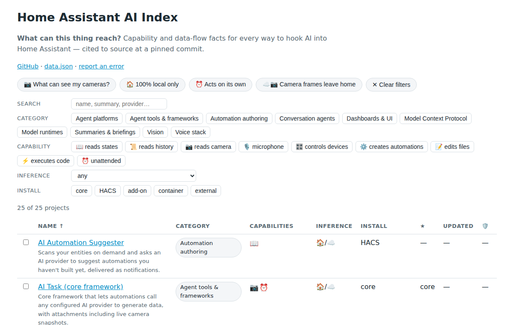

# Home Assistant AI Index

**What can this thing reach?** — the question every existing list skips.

Every roundup of Home Assistant AI integrations gives you stars and a name. None
answers the questions you actually have before installing one: can it see my
cameras? Can it act without me asking? Does my data leave my network, and where
does it go? This index answers those questions per project, with claims cited to
the project's own source code at a pinned commit.

**[Browse and filter the full index →](https://bruhautomation.github.io/home-assistant-ai-index/)**

[](https://bruhautomation.github.io/home-assistant-ai-index/)

## How to read this index

Each entry carries nine **capability flags** (what the project can reach), an
**inference** axis (where the model runs), and an **install surface**:

| | Capability | Meaning |
|---|---|---|
| 📖 | [reads states](https://bruhautomation.github.io/home-assistant-ai-index/#cap=reads_entity_states:require) | Reads the states of entities exposed to it |
| 📜 | [reads history](https://bruhautomation.github.io/home-assistant-ai-index/#cap=reads_history:require) | Queries recorder / history / logbook data |
| 📷 | [reads camera](https://bruhautomation.github.io/home-assistant-ai-index/#cap=reads_camera:require) | Accesses camera images or streams |
| 🎙️ | [microphone](https://bruhautomation.github.io/home-assistant-ai-index/#cap=listens_microphone:require) | Processes live audio |
| 🎛️ | [controls devices](https://bruhautomation.github.io/home-assistant-ai-index/#cap=controls_devices:require) | Calls Home Assistant services to actuate devices |
| ⚙️ | [creates automations](https://bruhautomation.github.io/home-assistant-ai-index/#cap=creates_automations:require) | Writes automations, scripts, or helpers |
| 📝 | [edits files](https://bruhautomation.github.io/home-assistant-ai-index/#cap=edits_files:require) | Writes to configuration files or the filesystem |
| ⚡ | [executes code](https://bruhautomation.github.io/home-assistant-ai-index/#cap=executes_code:require) | Runs arbitrary code beyond declared service calls |
| ⏰ | [unattended](https://bruhautomation.github.io/home-assistant-ai-index/#cap=runs_unattended:require) | Self-initiates AI activity on schedules or triggers by design |

Each capability links to the live list of projects that have it.

**Inference:** 🏠 local · ☁️ cloud · 🏠/☁️ your choice of backend decides.
The combinations are the point: *cloud inference + camera access* means your
camera frames leave your network. *Unattended + controls devices* means it can
act on your home without you asking. Filter for exactly that on
[the site](https://bruhautomation.github.io/home-assistant-ai-index/).

Capability flags on sensitive claims (camera, microphone, file writes, code
execution, unattended operation) link to the exact line of source that
implements them, pinned to a commit. Add-on entries additionally show the
permissions their packaging requests and Home Assistant's own
[add-on security rating](https://developers.home-assistant.io/docs/add-ons/security/),
computed by the Supervisor's published algorithm — that is the only score you
will find here.

## What this is not

- **Not a scoreboard.** No composite security score, no ranking. Tables sort
  alphabetically; facts carry evidence links instead of grades.
- **Not a HACS mirror.** Being installable is not the bar — being understood is.
  Entries exist because someone checked what the project can reach.
- **Not a review site.** No opinions on whether a project is good. Capability
  facts, data-flow facts, health metrics, and Home Assistant's own rating math.

## This is wrong about my project

If this index misstates what your project can reach, that is the bug we care
about most.
**[Open a correction →](https://github.com/bruhautomation/home-assistant-ai-index/issues/new?template=correction.yml)**
Maintainer corrections get priority handling, and a disputed flag is marked ⚠️
on the site immediately while it is resolved.

<!-- BEGIN GENERATED -->
**51 projects indexed**, metrics harvested 2026-08-27. Sorted by name — never by stars. [Filter, compare, and see the evidence on the site →](https://bruhautomation.github.io/home-assistant-ai-index/)

### Conversation agents

| Name | Capabilities | Inference | Install | Health | |
|---|---|---|---|---|---|
| [Anthropic Claude](https://github.com/home-assistant/core) | 📖🎛️ | ☁️ cloud | core | part of core | [→](https://bruhautomation.github.io/home-assistant-ai-index/entries/anthropic-conversation/) |
| [Azure OpenAI Conversation](https://github.com/joselcaguilar/azure-openai-ha) | 📖🎛️ | ☁️ cloud | HACS | ★ 74 · 2026-07-21 | [→](https://bruhautomation.github.io/home-assistant-ai-index/entries/azure-openai-conversation/) |
| [Extended OpenAI Conversation](https://github.com/jekalmin/extended_openai_conversation) | 📖📜🎛️⚙️📝⚡ | 🏠/☁️ choice | HACS | ★ 1.4k · 2026-05-17 | [→](https://bruhautomation.github.io/home-assistant-ai-index/entries/extended-openai-conversation/) |
| [Fallback Conversation Agent](https://github.com/m50/ha-fallback-conversation) | — | 🏠/☁️ choice | HACS | ★ 81 · 2024-12-04 · ⚠️ archived | [→](https://bruhautomation.github.io/home-assistant-ai-index/entries/fallback-conversation/) |
| [Google Generative AI](https://github.com/home-assistant/core) | 📖🎛️ | ☁️ cloud | core | part of core | [→](https://bruhautomation.github.io/home-assistant-ai-index/entries/google-generative-ai/) |
| [Home LLM](https://github.com/acon96/home-llm) | 📖🎛️ | 🏠/☁️ choice | HACS | ★ 1.4k · 2026-07-07 | [→](https://bruhautomation.github.io/home-assistant-ai-index/entries/home-llm/) |
| [MCP Assist](https://github.com/mike-nott/mcp-assist) | 📖📜🎛️ | 🏠/☁️ choice | HACS | ★ 101 · 2026-08-02 | [→](https://bruhautomation.github.io/home-assistant-ai-index/entries/mcp-assist/) |
| [Mistral AI Conversation](https://github.com/Elijaht-dev/mistralai-conversation) | 📖🎙️🎛️ | ☁️ cloud | HACS | ★ 3 · 2026-08-23 | [→](https://bruhautomation.github.io/home-assistant-ai-index/entries/mistral-conversation/) |
| [Ollama](https://github.com/home-assistant/core) | 📖🎛️ | 🏠 local | core | part of core | [→](https://bruhautomation.github.io/home-assistant-ai-index/entries/ollama-conversation/) |
| [OpenAI Conversation](https://github.com/home-assistant/core) | 📖🎛️ | ☁️ cloud | core | part of core | [→](https://bruhautomation.github.io/home-assistant-ai-index/entries/openai-conversation/) |
| [OpenRouter](https://github.com/home-assistant/core) | 📖🎛️ | ☁️ cloud | core | part of core | [→](https://bruhautomation.github.io/home-assistant-ai-index/entries/openrouter-conversation/) |
| [xAI Grok Conversation](https://github.com/braytonstafford/grok_conversation) | 📖🎛️ | ☁️ cloud | HACS | ★ 41 · 2026-08-12 | [→](https://bruhautomation.github.io/home-assistant-ai-index/entries/grok-conversation/) |

### Agent platforms

| Name | Capabilities | Inference | Install | Health | |
|---|---|---|---|---|---|
| [brAIn](https://github.com/bruhautomation/BRUH-HA-Apps) | 📖📜📷🎛️⚙️📝⚡⏰ | ☁️ cloud | add-on | ★ 1 · 2026-08-25 · 🛡️ 6/8 | [→](https://bruhautomation.github.io/home-assistant-ai-index/entries/brain/) |
| [Home Generative Agent](https://github.com/goruck/home-generative-agent) | 📖📜📷🎛️⚙️⏰ | 🏠/☁️ choice | HACS | ★ 288 · 2026-08-27 | [→](https://bruhautomation.github.io/home-assistant-ai-index/entries/home-generative-agent/) |

### Vision

| Name | Capabilities | Inference | Install | Health | |
|---|---|---|---|---|---|
| [AI on the Edge Device](https://github.com/jomjol/AI-on-the-edge-device) | ⏰ | 🏠 local | external | ★ 8.6k · 2026-07-03 | [→](https://bruhautomation.github.io/home-assistant-ai-index/entries/ai-on-the-edge-device/) |
| [Amazon Rekognition](https://github.com/robmarkcole/HASS-amazon-rekognition) | 📷 | ☁️ cloud | HACS | ★ 89 · 2026-04-13 | [→](https://bruhautomation.github.io/home-assistant-ai-index/entries/amazon-rekognition/) |
| [BirdNET-Go](https://github.com/tphakala/birdnet-go) | 📷🎙️⏰ | 🏠 local | add-on, container | ★ 1.6k · 2026-08-26 · 🛡️ 7/8 | [→](https://bruhautomation.github.io/home-assistant-ai-index/entries/birdnet-go/) |
| [Frigate](https://github.com/blakeblackshear/frigate) | 📷🎙️⏰ | 🏠/☁️ choice | add-on, container | ★ 35.4k · 2026-08-27 · 🛡️ 6/8 | [→](https://bruhautomation.github.io/home-assistant-ai-index/entries/frigate/) |
| [LLM Vision](https://github.com/valentinfrlch/ha-llmvision) | 📷 | 🏠/☁️ choice | HACS | ★ 1.4k · 2026-08-23 | [→](https://bruhautomation.github.io/home-assistant-ai-index/entries/llm-vision/) |
| [Ollama Vision](https://github.com/remimikalsen/ollama_vision) | 📷 | 🏠 local | HACS | ★ 21 · 2026-01-17 | [→](https://bruhautomation.github.io/home-assistant-ai-index/entries/ollama-vision/) |

### Automation authoring

| Name | Capabilities | Inference | Install | Health | |
|---|---|---|---|---|---|
| [AI Agent HA](https://github.com/sbenodiz/ai_agent_ha) | 📖📜🎛️⚙️📝 | 🏠/☁️ choice | HACS | ★ 156 · 2026-07-14 | [→](https://bruhautomation.github.io/home-assistant-ai-index/entries/ai-agent-ha/) |
| [AI Automation Suggester](https://github.com/ITSpecialist111/ai_automation_suggester) | 📖 | 🏠/☁️ choice | HACS | ★ 772 · 2026-07-11 | [→](https://bruhautomation.github.io/home-assistant-ai-index/entries/ai-automation-suggester/) |

### Model Context Protocol

| Name | Capabilities | Inference | Install | Health | |
|---|---|---|---|---|---|
| [hass-mcp](https://github.com/voska/hass-mcp) | 📖📜🎛️ | 🏠/☁️ choice | container, external | ★ 336 · 2026-08-06 | [→](https://bruhautomation.github.io/home-assistant-ai-index/entries/hass-mcp/) |
| [MCP Server (core)](https://github.com/home-assistant/core) | 📖🎛️ | 🏠/☁️ choice | core | part of core | [→](https://bruhautomation.github.io/home-assistant-ai-index/entries/mcp-server/) |
| [MCP Server (HTTP Transport)](https://github.com/ganhammar/hass-mcp-server) | 📖📜📷🎛️⚙️📝 | 🏠/☁️ choice | HACS | ★ 67 · 2026-08-27 | [→](https://bruhautomation.github.io/home-assistant-ai-index/entries/hass-mcp-server/) |
| [MCP Server for Xiaozhi](https://github.com/c1pher-cn/ha-mcp-for-xiaozhi) | 📖🎛️ | 🏠/☁️ choice | HACS | ★ 265 · 2026-08-23 | [→](https://bruhautomation.github.io/home-assistant-ai-index/entries/ha-mcp-for-xiaozhi/) |
| [Model Context Protocol (client)](https://github.com/home-assistant/core) | — | 🏠/☁️ choice | core | part of core | [→](https://bruhautomation.github.io/home-assistant-ai-index/entries/mcp-client/) |
| [Xiaozhi MCP](https://github.com/mac8005/xiaozhi-mcp-ha) | 📖🎛️ | 🏠/☁️ choice | HACS | ★ 106 · 2025-09-10 | [→](https://bruhautomation.github.io/home-assistant-ai-index/entries/xiaozhi-mcp/) |

### Agent tools & frameworks

| Name | Capabilities | Inference | Install | Health | |
|---|---|---|---|---|---|
| [AI Task (core framework)](https://github.com/home-assistant/core) | 📷⏰ | 🏠/☁️ choice | core | part of core | [→](https://bruhautomation.github.io/home-assistant-ai-index/entries/ai-task/) |

### Model runtimes

| Name | Capabilities | Inference | Install | Health | |
|---|---|---|---|---|---|
| [LocalAI](https://github.com/mudler/LocalAI) | — | 🏠 local | container, external | ★ 48.7k · 2026-08-27 | [→](https://bruhautomation.github.io/home-assistant-ai-index/entries/localai/) |
| [Ollama (server)](https://github.com/ollama/ollama) | — | 🏠 local | container, external | ★ 179.6k · 2026-08-27 | [→](https://bruhautomation.github.io/home-assistant-ai-index/entries/ollama-server/) |

### Voice stack

| Name | Capabilities | Inference | Install | Health | |
|---|---|---|---|---|---|
| [Assist Microphone](https://github.com/home-assistant/addons) | 🎙️ | 🏠 local | add-on | official add-on · 🛡️ 5/8 | [→](https://bruhautomation.github.io/home-assistant-ai-index/entries/assist-microphone/) |
| [ElevenLabs](https://github.com/home-assistant/core) | 🎙️ | ☁️ cloud | core | part of core | [→](https://bruhautomation.github.io/home-assistant-ai-index/entries/elevenlabs/) |
| [Google Cloud (STT/TTS)](https://github.com/home-assistant/core) | 🎙️ | ☁️ cloud | core | part of core | [→](https://bruhautomation.github.io/home-assistant-ai-index/entries/google-cloud-speech/) |
| [Microsoft Edge TTS](https://github.com/hasscc/hass-edge-tts) | — | ☁️ cloud | HACS | ★ 485 · 2026-06-05 | [→](https://bruhautomation.github.io/home-assistant-ai-index/entries/edge-tts/) |
| [microWakeWord](https://github.com/kahrendt/microWakeWord) | 🎙️ | 🏠 local | external | ★ 9 · 2026-07-09 | [→](https://bruhautomation.github.io/home-assistant-ai-index/entries/microwakeword/) |
| [OpenAI TTS](https://github.com/sfortis/openai_tts) | — | ☁️ cloud | HACS | ★ 210 · 2026-08-25 | [→](https://bruhautomation.github.io/home-assistant-ai-index/entries/openai-tts/) |
| [OpenAI Whisper Cloud STT](https://github.com/fabio-garavini/ha-openai-whisper-stt-api) | 🎙️ | 🏠/☁️ choice | HACS | ★ 107 · 2026-08-04 | [→](https://bruhautomation.github.io/home-assistant-ai-index/entries/whisper-cloud-stt/) |
| [openWakeWord](https://github.com/rhasspy/wyoming-openwakeword) | 🎙️ | 🏠 local | add-on, container | ★ 203 · 2025-10-30 · 🛡️ 5/8 | [→](https://bruhautomation.github.io/home-assistant-ai-index/entries/openwakeword-addon/) |
| [Piper (text-to-speech)](https://github.com/rhasspy/wyoming-piper) | — | 🏠 local | add-on, container | ★ 204 · 2026-08-13 · 🛡️ 5/8 | [→](https://bruhautomation.github.io/home-assistant-ai-index/entries/piper-addon/) |
| [Speech-to-Phrase](https://github.com/OHF-Voice/speech-to-phrase) | 📖🎙️ | 🏠 local | add-on, container | ★ 330 · 2026-07-27 · 🛡️ 5/8 | [→](https://bruhautomation.github.io/home-assistant-ai-index/entries/speech-to-phrase/) |
| [Stream Assist](https://github.com/AlexxIT/StreamAssist) | 📷🎙️ | 🏠/☁️ choice | HACS | ★ 387 · 2024-07-30 | [→](https://bruhautomation.github.io/home-assistant-ai-index/entries/stream-assist/) |
| [Voice Preview Edition (firmware)](https://github.com/esphome/home-assistant-voice-pe) | 🎙️ | 🏠 local | external | ★ 739 · 2026-08-23 | [→](https://bruhautomation.github.io/home-assistant-ai-index/entries/voice-pe-firmware/) |
| [Voice Satellite](https://github.com/jxlarrea/voice-satellite-card-integration) | 🎙️ | 🏠 local | HACS | ★ 723 · 2026-08-27 | [→](https://bruhautomation.github.io/home-assistant-ai-index/entries/voice-satellite/) |
| [Vosk (speech-to-text)](https://github.com/rhasspy/wyoming-vosk) | 🎙️ | 🏠 local | add-on, container | ★ 22 · 2026-03-12 · 🛡️ 5/8 | [→](https://bruhautomation.github.io/home-assistant-ai-index/entries/wyoming-vosk/) |
| [Whisper (speech-to-text)](https://github.com/rhasspy/wyoming-faster-whisper) | 🎙️ | 🏠 local | add-on, container | ★ 372 · 2026-08-14 · 🛡️ 5/8 | [→](https://bruhautomation.github.io/home-assistant-ai-index/entries/whisper-addon/) |
| [Willow](https://github.com/toverainc/willow) | 📖🎙️ | 🏠/☁️ choice | external | ★ 3.1k · 2026-08-04 | [→](https://bruhautomation.github.io/home-assistant-ai-index/entries/willow/) |
| [Wyoming Satellite](https://github.com/rhasspy/wyoming-satellite) | 🎙️ | 🏠 local | external | ★ 1.2k · 2026-01-24 · ⚠️ archived | [→](https://bruhautomation.github.io/home-assistant-ai-index/entries/wyoming-satellite/) |

### Dashboards & UI

| Name | Capabilities | Inference | Install | Health | |
|---|---|---|---|---|---|
| [View Assist](https://github.com/dinki/View-Assist) | 📖 | 🏠/☁️ choice | external | ★ 511 · 2026-08-04 | [→](https://bruhautomation.github.io/home-assistant-ai-index/entries/view-assist/) |

### Summaries & briefings

| Name | Capabilities | Inference | Install | Health | |
|---|---|---|---|---|---|
| [HA Text AI](https://github.com/smkrv/ha-text-ai) | — | 🏠/☁️ choice | HACS | ★ 80 · 2026-07-21 | [→](https://bruhautomation.github.io/home-assistant-ai-index/entries/ha-text-ai/) |
| [Marlin Analyzer](https://github.com/kotope/marlin-ha-integration) | 📷⏰ | 🏠/☁️ choice | HACS, container | ★ 0 · 2026-06-08 | [→](https://bruhautomation.github.io/home-assistant-ai-index/entries/marlin-analyzer/) |
<!-- END GENERATED -->

## Contributing

Add a project by copying an entry in [`entries/`](entries/) and opening a PR —
[CONTRIBUTING.md](CONTRIBUTING.md) defines every capability flag objectively so
flags are checkable, not vibes. Or use the
[submit-a-project issue form](https://github.com/bruhautomation/home-assistant-ai-index/issues/new?template=submit-project.yml)
and we'll do the research.

Maintainers of listed projects are welcome to link back:

```markdown
[](https://github.com/bruhautomation/home-assistant-ai-index)
```

## Data

Everything on the site is published as machine-readable JSON at
[`data.json`](https://bruhautomation.github.io/home-assistant-ai-index/data.json)
— a stable, documented artifact you can build bots and dashboards on. Harvested
metrics refresh nightly; each entry page shows exactly when.

## License

Tool code is [MIT](LICENSE). Catalog content (entries, tables, published data)
is additionally [CC BY 4.0](https://creativecommons.org/licenses/by/4.0/) —
reuse with attribution to "Home Assistant AI Index".
